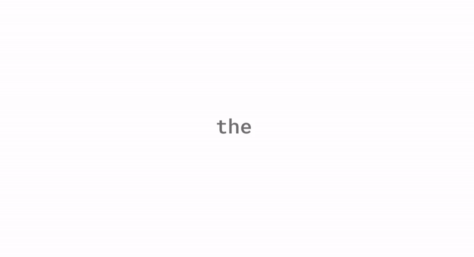

# Real-time ASL Translator

Healthcare & Accessibility Tech finalist project for What The Hack 2022.

## Requirements

- Python 3.10.8
- UNIX/UNIX-like machine
- CUDA-compiled PyTorch

## Potential Improvements

Too many.
